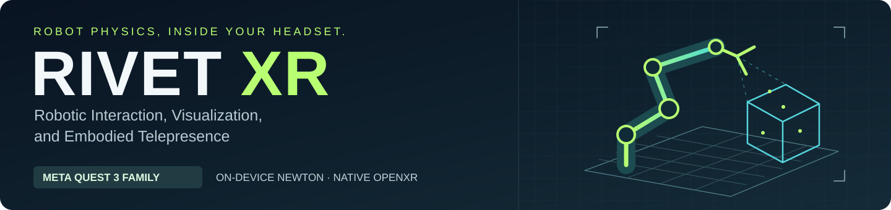
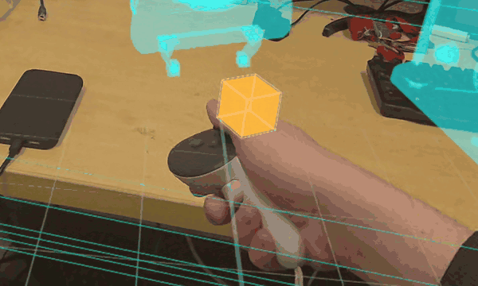
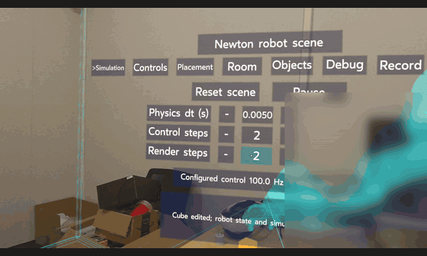
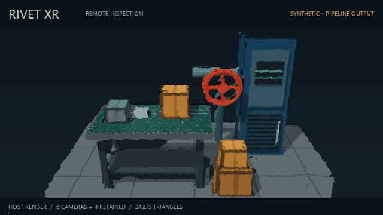

<p align="center">
  
</p>

<p align="center">
  <strong>Meta Quest 3 family · Physics and rendering on the headset · Verified on Quest 3S</strong><br>
  Custom-optimized Newton CPU runtime &nbsp; / &nbsp; Custom native OpenXR renderer &nbsp; / &nbsp; RGB-D scene inspection
</p>

<p align="center">
  <a href="#quick-start">Quick start</a> ·
  <a href="docs/BUILDING.md">Build for Quest</a> ·
  <a href="docs/REMOTE_SCENE.md">Depth &amp; telepresence</a> ·
  <a href="docs/MEDIA.md">Demo provenance</a> ·
  <a href="https://github.com/Jdowdy05/RivetXR/archive/refs/heads/main.zip">Download source</a>
</p>

**RIVET XR** brings a robot simulation into your physical workspace and lets you
inspect camera-observed environments from a new viewpoint. **R**obotic
**I**nteraction, **V**isualization, and **E**mbodied **T**elepresence—built around
a native headset application, rather than a streamed desktop simulator.

## See it in action

<table>
  <tr>
    <th width="33%" align="left">01 &nbsp; On-device robot physics</th>
    <th width="33%" align="left">02 &nbsp; Your VR control room</th>
    <th width="33%" align="left">03 &nbsp; Depth → textured 3D</th>
  </tr>
  <tr>
    <td></td>
    <td></td>
    <td></td>
  </tr>
  <tr>
    <td valign="top"><strong>QUEST RECORDING</strong><br>Controller-driven arm and scene objects. Physics on device.</td>
    <td valign="top"><strong>QUEST RECORDING</strong><br>In-VR timing, settings and controller rays.</td>
    <td valign="top"><strong>SYNTHETIC</strong><br>Six RGB-D views → reconstructed mesh. Host preview. <a href="docs/media/inspection-inputs.png">Inputs.</a></td>
  </tr>
</table>

The first two clips are recorded development builds on **Quest 3S**. The third
is an offline synthetic demonstration—not a headset capture or a live robot
test. [Media details and reproduction](docs/MEDIA.md).

## What makes RIVET XR different

| On the headset | In the sensing pipeline |
|---|---|
| **Newton physics, on device.** One articulated robot with rigid-body dynamics, gravity, contacts and analog gripper control. | **Depth becomes inspectable space.** Calibrated depth plus grayscale/RGB observations become textured surface patches. |
| **Custom-optimized execution.** CPU dispatch, staging and array reuse reduce overhead around Newton's MuJoCo-backed solver. | **Choose where to reconstruct.** Send prepared geometry from the robot/host, or let the Quest receive worker build it from calibrated images. |
| **Custom native renderer.** C++20, GLES and OpenXR own stereo drawing, passthrough, controller input and in-VR tools. | **One scene downlink.** Bounded observation retention preserves recently seen surfaces; separate clutched camera control currently drives a simulated gimbal. |

The local robot simulation and renderer execute on the headset; a PC does not
step the live physics scene. The custom optimization is in the runtime and CPU
solver adapter: **Newton/MuJoCo's physics equations are retained**. This is not
Newton's desktop viewer running in VR.

## From camera observations to a new viewpoint

```text
Robot-side RGB / intensity + depth + exposure-time poses
                         ↓
          Bounded, calibrated observation cache
                         ↓
        Prepared mesh  OR  calibrated image batches
                         ↓
                One pinned-TLS scene stream
                         ↓
        Quest receive worker → native stereo renderer
```

The robot/host owns retained observations in either mode. Remote surfaces are
visual inspection data; they are separate from local Newton and room colliders.
See [camera setup, coordinate frames and controls](docs/REMOTE_SCENE.md).

<a name="try-the-host-pipeline"></a>

## Quick start

**Experimental source release.** Start with the host demos; no headset, camera,
Newton installation or GPU is needed for synthetic packet generation. A prebuilt
APK and external robot assets are not distributed in this release.

```sh
git clone https://github.com/Jdowdy05/RivetXR.git
cd RivetXR
```

Create a **Python 3.12** environment:

| Windows PowerShell | Linux / macOS |
|---|---|
| `py -3.12 -m venv .venv` | `python3.12 -m venv .venv` |
| `.\.venv\Scripts\Activate.ps1` | `. .venv/bin/activate` |

```sh
python -m pip install -r requirements-remote.txt
python -m unittest discover -s tools/remote_scene/tests -v
python -m tools.remote_scene.demo --output out/demo/remote_scene/demo.rscn --all-modes
```

If PowerShell blocks activation, use `.\.venv\Scripts\python.exe` in place of
`python`. The generator creates five `.rscn` scene packets, not a desktop GUI or
video. TLS tests also need OpenSSL; check for skipped tests.

[Android prerequisites and build guide](docs/BUILDING.md) ·
[Synthetic streaming and replay](docs/REMOTE_SCENE.md) ·
[Recreate the inspection GIF](docs/MEDIA.md#synthetic-inspection-demo)

## Status & boundaries

- **Device demonstrated:** the full CPU simulation on Quest 3S, controller-driven
  virtual arm motion, passthrough and in-VR tools. Quest 3 is a declared target;
  the footage and recorded device checks here use Quest 3S.
- **Host verified:** prepared/unprepared RGB reconstruction, bounded retention,
  protocol compatibility, replay and simulated gimbal control. New RGB headset
  visuals and simultaneous camera/physics performance still need qualification.
- **Still open:** reliable pinch/lift/place, physical robot and gimbal drivers,
  and walking-robot qualification. The map is observed surface patches, not
  TSDF/SLAM, a watertight world or hidden-surface completion.

## Develop & contribute

`quest/` contains the headset application, `tools/remote_scene/` the sensing
pipeline, and `src/` the native runtime and kinematics. Start with
[the build guide](docs/BUILDING.md) and [contribution notes](CONTRIBUTING.md).
Preserve explicit frames, units, validity, timestamps and failure behavior.

Original project code is **[MIT](LICENSE)**. The adapted Newton CPU solver
retains Apache-2.0, and external SDKs, libraries and robot assets keep their
own terms. [Third-party notices](THIRD_PARTY_NOTICES.md).
